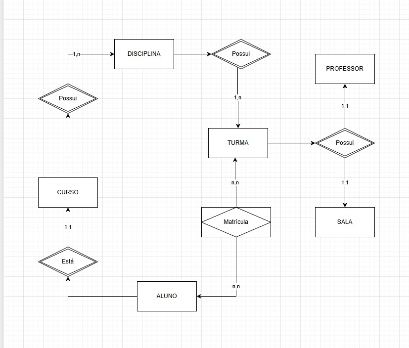

# Projeto Final: Banco de Dados Relacional

## Objetivo

Este repositório contém o projeto final da disciplina de Banco de Dados Relacional. O objetivo é aplicar os conceitos estudados, incluindo modelagem, normalização e manipulação de dados utilizando DDL, DML, DQL — com bonificação para comandos DCL e DTL.

## Integrantes do Grupo

- João Victor Machado Pinto
- Pedro Vieira Cavalciuk
- Vitor Henrique da Silva Fogaça

## Tema Escolhido

Gerenciamento universitário

O sistema tem como objetivo gerenciar informações relacionadas a cursos, disciplinas, professores, alunos, turmas, salas e matrículas. Ele permite que instituições de ensino organizem melhor seus recursos e acompanhem a trajetória acadêmica dos estudantes. Esse projeto demonstra a aplicação prática dos conceitos de banco de dados relacionais, como modelagem, integridade referencial e normalização.

## Modelagem de Dados

### Entidades, Atributos e Relacionamentos
* **CURSO:** id\_curso (PK), nome\_curso, duracao
* **DISCIPLINA:** id\_disciplina (PK), nome\_disciplina, carga\_horaria, id\_curso (FK)
* **PROFESSOR:** id\_professor (PK), nome\_professor, email, titulacao
* **SALA:** id\_sala (PK), numero, capacidade, bloco
* **TURMA:** id\_turma (PK), semestre, horario, id\_disciplina (FK), id\_sala (FK), id\_professor (FK)
* **ALUNO:** id\_aluno (PK), nome\_aluno, matricula, email, id\_curso (FK)
* **MATRÍCULA:** id\_matricula (PK), id\_aluno (FK), id\_turma (FK), data\_matricula, nota\_final, status
Descrição geral das entidades envolvidas e seus relacionamentos.

### Diagrama Entidade-Relacionamento (DER)

## Normalização

O banco de dados foi normalizado até a **Terceira Forma Normal (3NF)**.

1NF: Eliminação de grupos repetitivos — todas as tabelas têm atributos atômicos.

2NF: Eliminação de dependências parciais — todas as tabelas têm chaves primárias simples (exceto possivelmente MATRICULA), e atributos dependem totalmente delas.

3NF: Eliminação de dependências transitivas — os atributos não dependem de outros atributos que não sejam chave.

Exemplo:
Na tabela ALUNO, o curso é armazenado por meio de chave estrangeira, evitando duplicidade de dados como nome do curso.

## Scripts SQL

Todos os scripts estão localizados na pasta `/sql`.

### DDL (Data Definition Language)

- Criação de tabelas
- Definição de chaves primárias e estrangeiras
- Restrições de integridade

[Abrir o DDL](sql/ddl.sql)

### DML (Data Manipulation Language)

[Abrir o DML](sql/dml.sql)

### DQL (Data Query Language)

[Abrir o DQL](sql/dql.sql)

### DCL (Data Control Language)

[Abrir o DCL](sql/dcl.sql)`

### DTL (Data Transaction Language)

[Abrir o DTL](sql/dtl.sql)

## Documentação (ABNT)

Está estruturada conforme as normas da ABNT, contendo:

- Introdução
- Modelagem conceitual e lógica
- Scripts comentados
- Conclusão e referências

[Abrir a documentação](./BancoDeDadosDocument.pdf)

## Requisitos Técnicos

- **SGBD utilizado**: PostgreSQL 
- **Versão recomendada**: PostgreSQL 15+
- **Ferramentas utilizadas**:
  - PostgreSQL, Docker, VSCode, MySQl e draw.io.
